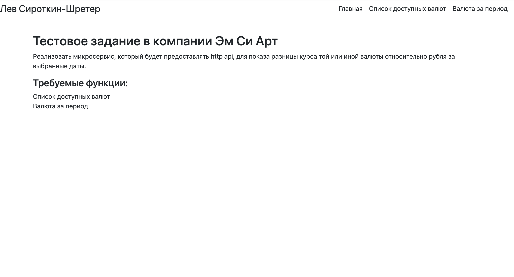

#Задание:
Реализовать сервис, который будет предоставлять возможность увидеть разницу курса той или иной валюты относительно рубля за выбранные даты.

###Потребуется установка:
```
% pip install django
```

###Запуск сервера производится командой:
```
mcart % python3 manage.py runserver
```

###После запуска сервера:
Открыв сайт, будет видна главная страница. 
Сверху в шапке будут ссылки на требуемый функционал, так же они будут присутствовать и в самом теле главной страницы.

На странице "Список доступных валют" (_/currency_list_) 
отображается актуальный список валют, который подгружается с необходимого API, 
тут выполняется требование, описанное в методе (А) тестового задания.

На странице "Валюта за период" (_/exchange_rate_) отображается функционал для получения разницы курса 
относительно рубля между двумя датами за выбранную дату, функционал полей следющий:
- Первое поле (Символ валюты) подразумевает ввод символьного кода валюты;
- Второе поле (Начальная дата) требует ввода начальной даты в формате YYYY-MM-DD;
- Третье поле (Конечная дата) требует ввода конечной даты в формате YYYY-MM-DD;
- Кнопка (Узнать) принимает все данные выше, обновляет страницу и в поле снизу (История запроса) в самом верху отображается таблица с необходимой нам инофрмацией;

Все поля и вывод в соответствии с требованиями, описанными в методе (В), но так же была создана более полная версия вывода, со всей информацией.


###Важные заметки о структуре репозитория:

В _base.html_ храним все повторяющиеся стили/разметка, 
**Don't repeat yourself**. 
В остальных шаблонах html конкретные куски кода, отличающиеся от _base.html_.

В файле _settings.py_ изменены ключ и несколько параметров от локальной версии.

В папке _screenshots_ находятся скриншоты работы приложения для настоящего README.


###Скриншоты работы приложения:
**-Главная страница:**

**-Список доступных валют:**

**- Валюта за период:**

**- Валюта за период (ver.2):**


###В следующем обновлении планируется:
- Добавить юнит-тесты;
- Добавить докерфайл;
- Дополнить проверку на ошибочный ввод;